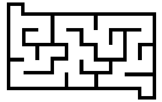
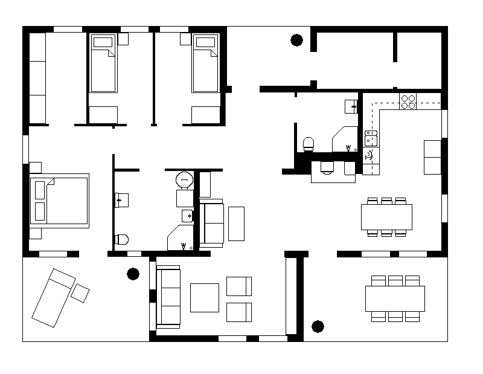

# Base Controller ([link](https://github.com/FilipeAlmeidaFEUP/ros2_flatland_robot_controller))

[Source](https://en.wikipedia.org/wiki/File:Maze_simple.svg)

[Source](https://ru.pinterest.com/pin/ho-slot-car-racing-ho-slot-car-track-layouts-2-and-4lane-race-tracks--637118678514235810/?amp_client_id=CLIENT_ID(_)&mweb_unauth_id=&simplified=true)

[Source](https://www.roomsketcher.com/house-plans/)
