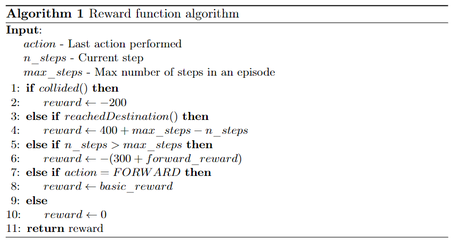

# RL tutorial ([link](https://github.com/FilipeAlmeidaFEUP/ros2_flatland_rl_tutorial))

## Theoretical concepts

This tutorial explains several RL concepts, such as the agent, the environment, the action space, the observation space, the state, the reward function, the step and the episode. It also explains the importance of each one and how they all need to be used together to create a RL system.

## Practical concepts

This tutorial shows the user how to: 
1. Create a class that inherits from the Env class from the Gym Python package to create a standard RL environment
2. Initialize the action and observation spaces and the state
3. Override the step, reset, render and close functions from the Env class that define the behavior of the agent and the environment
4. Use the environment class created to run any RL algorithm from the Stable-Baselines3 package
5. Test a trained agent
6. Save and load the weights of a trained agent
7. Define a training strategy to improve the chances of the agent learning the task.

## Self-Learning/Autonomous work

During the tutorial, the users are presented with the following challenges:
1. Trying to improve the reward function to make the agent learn even faster
2. Test different RL algorithms from the ones available in the Stable-Baselines3 package
3. Develop their own projects and experiment with different maps, setups or tasks.

